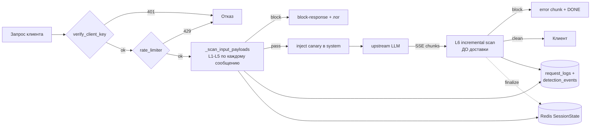
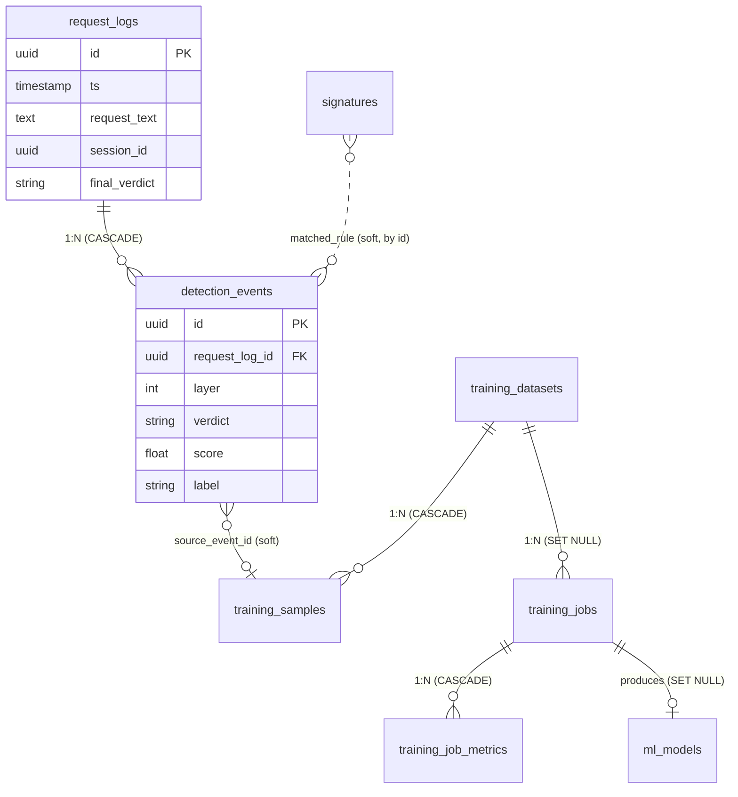
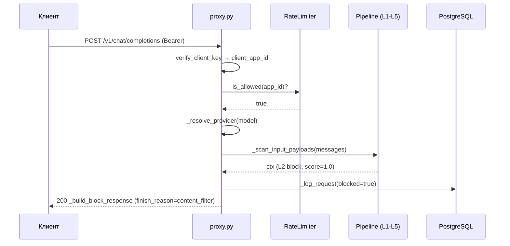
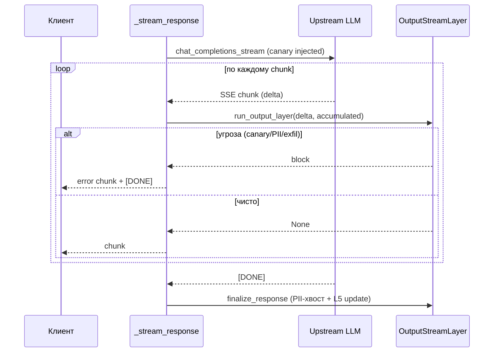
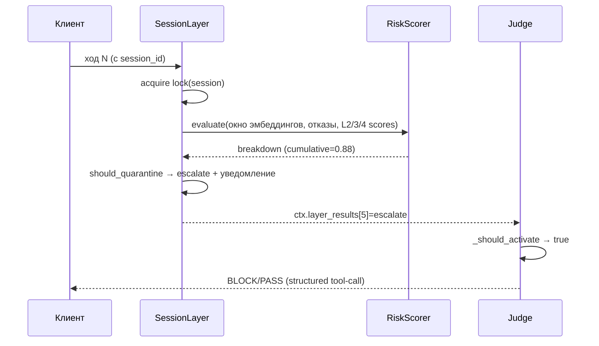
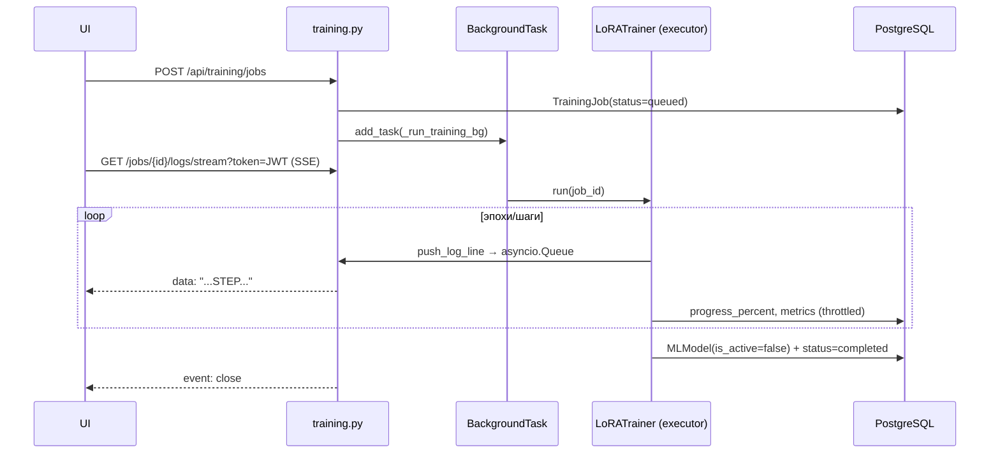
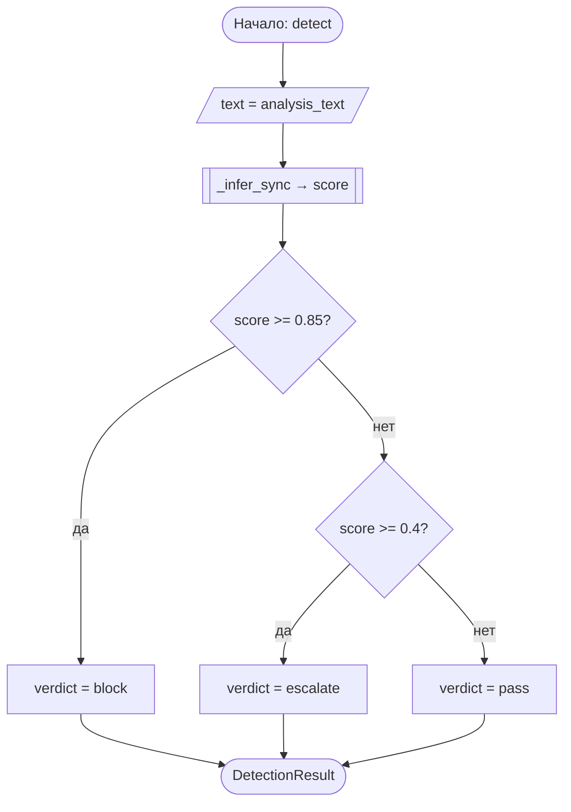

# КАРТА ПРОЕКТА — ArgusGate

> Самохостируемый security-gateway для LLM. 7-слойный конвейер детекции атак на входящий запрос и исходящий поток ответа, поверх OpenAI-совместимого прокси.
>
> Документ — единый справочник для защиты проекта. Каждое утверждение привязано к файлу/функции/строкам. Раздел читается сверху вниз, но самодостаточен по частям.
>
> Версия кода на момент составления: ветка `main`, `app.version = "1.0.0"` (`backend/app/main.py:199`).

---

## Оглавление

1. [Краткое резюме](#1-краткое-резюме)
2. [Архитектура](#2-архитектура)
3. [Функционал](#3-функционал)
4. [Ключевые механизмы и алгоритмы](#4-ключевые-механизмы-и-алгоритмы)
5. [Модель данных](#5-модель-данных)
6. [Потоки выполнения](#6-потоки-выполнения)
7. [API / интерфейсы](#7-api--интерфейсы)
8. [Безопасность — комплексный аудит](#8-безопасность--комплексный-аудит)
9. [Масштабируемость, производительность, отказоустойчивость](#9-масштабируемость-производительность-отказоустойчивость)
10. [Сборка, запуск, тестирование, развёртывание](#10-сборка-запуск-тестирование-развёртывание)
11. [Документация по ГОСТ и ЕСПД](#11-документация-по-гост-и-еспд)
12. [Подготовка к защите — вопросы и ответы](#12-подготовка-к-защите--вопросы-и-ответы)
13. [Глоссарий](#13-глоссарий)

---

## 1. Краткое резюме

### 1.1. Назначение и решаемая задача

ArgusGate — это **обратный прокси (security gateway) между клиентским приложением и LLM-провайдером** (OpenAI/Anthropic). Клиент шлёт обычный запрос `POST /v1/chat/completions`, gateway:

1. аутентифицирует клиентское приложение по Bearer-токену (`backend/app/auth.py:73`);
2. прогоняет каждое non-system сообщение через входной конвейер из слоёв 1–5 (нормализация → сигнатуры → векторное сходство → ML-классификатор → анализ сессии);
3. если ни один слой не дал `block`/`escalate` сверх порога — проксирует запрос к upstream-провайдеру;
4. **инкрементально** сканирует исходящий поток ответа (слой 6) ещё до доставки токенов клиенту;
5. при подозрении эскалирует на LLM-судью (слой 7);
6. пишет аудит (PostgreSQL), обновляет состояние сессии (Redis), публикует live-события и уведомления.

Помимо runtime-защиты, система содержит **полноценный backoffice**: дашборд метрик, аудит-лог с ручной разметкой, управление сигнатурами и векторной базой атак, конструктор датасетов из размеченного аудита и **дообучение ML-классификатора (LoRA) прямо из UI** с живым стримингом логов.

### 1.2. Решаемые классы атак

| Класс атаки | Слой-обработчик |
|---|---|
| Обфускация (homoglyph, zero-width, base64, percent/HTML-encoding) | L1 |
| Известные паттерны jailbreak/injection, PII во вводе | L2 |
| Семантические клоны известных атак | L3 |
| Неизвестные prompt-injection (ML) | L4 |
| Multi-turn атаки: Crescendo, переформулировка после отказа, саморефлексия | L5 |
| Утечка system-prompt (canary), PII/exfiltration/«сдача модели» в ответе | L6 |
| Пограничные случаи — арбитраж LLM-судьёй | L7 |

### 1.3. Целевые пользователи

- **Оператор/администратор безопасности** — настраивает слои, разбирает аудит, размечает события, обучает модели (единственная роль в UI, см. §8.2).
- **Разработчик клиентского приложения** — получает gateway-токен, шлёт через ArgusGate как через обычный OpenAI endpoint.

### 1.4. Стек технологий с обоснованием

| Технология | Версия (`backend/pyproject.toml`) | Зачем именно она |
|---|---|---|
| Python | 3.12 | Современный async, `X \| None` синтаксис |
| FastAPI | ≥0.115 | ASGI, нативный async, SSE через `StreamingResponse`, DI через `Depends`, OpenAPI «из коробки» |
| Uvicorn | ≥0.30 | ASGI-сервер; запущен в **1 worker** (`backend/Dockerfile`, `CMD … --workers 1`) |
| SQLAlchemy 2.x (async) + asyncpg | ≥2.0.36 / ≥0.30 | Параметризованный ORM (защита от SQLi), async-движок под asyncpg |
| Alembic | ≥1.14 | Версионирование схемы; миграции применяются на старте |
| Redis (redis-py asyncio + hiredis) | ≥5.2 | Состояние сессий, кэш, rate-limit (Lua), pub/sub, layer-config |
| Qdrant (AsyncQdrantClient) | сервер v1.13.1 / клиент ≥1.13 | Векторный поиск похожих атак, cosine, dim 384 |
| PyTorch | ≥2.5 | Инференс/обучение DeBERTa; CPU по умолчанию, CUDA опционально |
| transformers / optimum[onnxruntime] / onnxruntime | ≥4.47 / ≥1.23 / ≥1.20 | DeBERTa-v3; **ONNX-runtime на CPU** для быстрого инференса |
| PEFT | ≥0.14 | LoRA-адаптеры (дообучение «дёшево») |
| sentence-transformers | ≥3.3 | `all-MiniLM-L6-v2` эмбеддинги (L3/L5/L6) |
| Presidio + spaCy `en_core_web_lg` | ≥2.2.355 / ≥3.8 | NER/PII-детекция (L2 ввод, L6 вывод) |
| pyahocorasick | ≥2.1 | Aho-Corasick для keyword-сигнатур (мульти-паттерн O(n)) |
| python-jose | ≥3.3 | JWT HS256 для админ-сессий |
| passlib[bcrypt] | ≥1.7.4 | Хеширование паролей пользователей |
| cryptography (Fernet) | (транзитивно) | Симметричное шифрование секретов в БД |
| msgpack | ≥1.1 | Компактная сериализация `SessionState` в Redis |
| structlog | ≥24.4 | Структурированные логи |
| React 19 + TypeScript + Vite + Tailwind + React Router + Recharts | `front/package.json` | SPA-дашборд |
| Nginx | (`front/nginx.conf`) | Reverse proxy `/api`, `/v1`, `/health`; раздача SPA |
| Docker Compose | `docker-compose.yml` | postgres:16, redis:7, qdrant:1.13.1, gateway, frontend, model-downloader |

**Объём:** ~12 600 строк Python (backend), ~17 300 строк TS/TSX (frontend), 92 HTTP-эндпоинта в 17 роутерах.

---

## 2. Архитектура

### 2.1. Архитектурный стиль и обоснование

**Монолитный ASGI-gateway** (один процесс FastAPI/Uvicorn, `--workers 1`) + **конвейер детекторов по паттерну Chain of Responsibility** с ранним выходом по вердикту `block`.

Почему монолит, а не микросервисы:
- Слои детекции делят дорогие ресурсы (ML-модели, эмбеддер, Presidio-движок) — выносить каждый в отдельный сервис означало бы дублировать ~2 ГБ моделей в памяти и платить сетевой латентностью на каждом hop. Вместо этого модели грузятся **один раз** в `lifespan` и переиспользуются (например, Presidio из L2 переиспользуется в L6 — `backend/app/main.py:152-153`).
- Trade-off: монолит — single point of failure и не масштабируется горизонтально без переработки (см. §9). Для целевого сценария (self-hosted gateway перед одним-двумя приложениями) это осознанный компромисс в пользу простоты и латентности.

Внешнее состояние вынесено в три специализированных хранилища:
- **PostgreSQL** — долговременный аудит, сигнатуры, датасеты, задачи обучения, пользователи, зашифрованные настройки;
- **Redis** — эфемерное состояние сессий (msgpack), кэш, rate-limit (Lua token-bucket), конфиги слоёв, pub/sub для live-UI;
- **Qdrant** — векторная БД эмбеддингов известных атак.

### 2.2. Дерево каталогов

```
ArgusGate/
├─ backend/                          # FastAPI gateway
│  ├─ Dockerfile                     # python:3.12-slim, uv, spacy lg, offline HF, --workers 1
│  ├─ pyproject.toml                 # зависимости (uv), pytest-конфиг
│  ├─ alembic.ini, alembic/          # миграции 001–005 (см. §5)
│  └─ app/
│     ├─ main.py                     # FastAPI app + lifespan: миграции, сборка/связка 7 слоёв
│     ├─ config.py                   # pydantic-settings Settings (env)
│     ├─ db.py                       # async engine (pool 10+20), redis, qdrant клиенты
│     ├─ deps.py                     # module-level синглтоны сервисов (DI)
│     ├─ auth.py                     # JWT + verify_client_key (прокси-аутентификация)
│     ├─ api/                        # 17 роутеров (92 эндпоинта)
│     │  ├─ proxy.py                 # ВХОД ТРАФИКА: POST /v1/chat/completions
│     │  ├─ auth.py dashboard.py audit.py sessions.py layers.py signatures.py
│     │  ├─ vectors.py datasets.py training.py settings_api.py notifications.py
│     │  ├─ client_apps.py system_device.py users.py
│     │  ├─ layer_test.py            # тест отдельного слоя (+ L6 live-SSE)
│     │  └─ pipeline_test.py         # прогон всего конвейера без записи в БД
│     ├─ detectors/                  # ЯДРО детекции
│     │  ├─ base.py                  # BaseDetector (safe_detect — graceful degradation)
│     │  ├─ context.py               # RequestContext, DetectionResult
│     │  ├─ pipeline.py              # DetectionPipeline (chain + ранний выход)
│     │  └─ layer1_normalizer.py … layer7_judge.py
│     ├─ services/                   # бизнес-логика и инфраструктура
│     │  ├─ risk_scorer.py           # Crescendo + decay (ядро L5)
│     │  ├─ canary.py text_hasher.py # zero-width canary, keyed-BLAKE2b
│     │  ├─ session_lock.py session_pubsub.py session_repository.py
│     │  ├─ rate_limiter.py          # Lua token-bucket
│     │  ├─ provider_router.py       # выбор провайдера по префиксу модели
│     │  ├─ settings_service.py      # Fernet-шифрование секретов в БД
│     │  ├─ client_app_service.py user_service.py notification_service.py
│     │  ├─ model_path_validator.py  # защита от path-traversal
│     │  ├─ device_resolver.py hf_local.py category_whitelist.py
│     ├─ training/
│     │  ├─ lora_trainer.py          # HF Trainer + LoRA + SSE-логи + отмена
│     │  └─ evaluator.py             # eval на встроенном датасете
│     ├─ models/                     # SQLAlchemy ORM (12 таблиц)
│     ├─ schemas/                    # Pydantic DTO для API
│     └─ tests/                      # pytest: test_layer1..7 + test_pipeline (749 строк)
├─ front/                            # React 19 + TS SPA
│  ├─ nginx.conf                     # reverse proxy + SPA fallback
│  └─ src/                           # pages/, components/, hooks/, api/, contexts/
├─ signatures/                       # YAML-сигнатуры: jailbreak, prompt_injection, pii_patterns
├─ data/                             # датасеты (jsonl): deepset, harmbench, jailbreakbench, …
├─ models/                           # адаптеры LoRA (adapter_*) + deberta_onnx + sentence_transformers
├─ docs/                             # api.md, adding_signatures.md, demo_scenarios.md
├─ diagrams/                         # схемы (vsdx/drawio/png)
└─ docker-compose.yml                # оркестрация всего стека
```

### 2.3. Слои системы и их ответственность

| Слой кода | Ответственность |
|---|---|
| **API-роутеры** (`app/api/*`) | HTTP-контракты, валидация (Pydantic), авторизация (`Depends`) |
| **Pipeline** (`app/detectors/pipeline.py`) | Оркестрация порядка слоёв, ранний выход, пропуск L5/L6 по контексту |
| **Detectors** (`app/detectors/layerN_*`) | Конкретная логика детекции одного слоя; реализуют `BaseDetector.detect()` |
| **Services** (`app/services/*`) | Переиспользуемая логика без HTTP: риск-скоринг, lock, шифрование, rate-limit, pub/sub |
| **Models** (`app/models/*`) | Маппинг таблиц PostgreSQL |
| **Providers** (`app/providers/openai_compatible.py`) | Транспорт к upstream LLM (httpx, stream/non-stream) |

### 2.4. Компонентная диаграмма

```mermaid
graph TB
    subgraph Client
        APP[Клиентское приложение]
    end
    subgraph Browser
        SPA[React SPA<br/>dashboard]
    end
    subgraph Edge
        NGINX[Nginx<br/>/api /v1 /health]
    end
    subgraph Gateway["Gateway (FastAPI, 1 worker)"]
        PROXY[proxy.py<br/>/v1/chat/completions]
        ADMINAPI[Admin API<br/>17 роутеров]
        PIPE[DetectionPipeline]
        L1[L1 Normalizer]
        L2[L2 Signatures+PII]
        L3[L3 Vector]
        L4[L4 ML DeBERTa+LoRA]
        L5[L5 Session/Crescendo]
        L6[L6 Output stream]
        L7[L7 Judge]
        TRAIN[LoRATrainer]
    end
    subgraph Stores
        PG[(PostgreSQL)]
        RD[(Redis)]
        QD[(Qdrant)]
    end
    subgraph Upstream
        LLM[OpenAI / Anthropic]
    end

    APP -->|Bearer gateway-token| NGINX --> PROXY
    SPA -->|JWT| NGINX --> ADMINAPI
    PROXY --> PIPE
    PIPE --> L1 --> L2 --> L3 --> L4 --> L5
    PIPE --> L6
    L4 -.escalate.-> L7
    L5 -.escalate.-> L7
    PROXY -->|proxied| LLM
    L3 <--> QD
    L5 <--> RD
    L6 <--> RD
    L2 -.reuse Presidio.-> L6
    L3 -.embed.-> L5
    L3 -.embed.-> L6
    ADMINAPI <--> PG
    ADMINAPI <--> RD
    ADMINAPI <--> QD
    PROXY --> PG
    TRAIN --> PG
    TRAIN --> L4
```



### 2.5. Диаграмма потока данных (DFD)



---

## 3. Функционал

### 3.1. Runtime-функции (gateway)

| Функция | Где реализована | Как вызывается | Результат |
|---|---|---|---|
| Проксирование chat-completions | `api/proxy.py:chat_completions` (`:381`) | `POST /v1/chat/completions` | Ответ LLM или block-заглушка |
| Аутентификация клиента | `auth.py:verify_client_key` (`:73`) | dependency на proxy | `{client_app_id, name}` или 401 |
| Rate limiting | `services/rate_limiter.py:RateLimiter.is_allowed` (`:56`) | в начале proxy | 429 при превышении |
| Резолв провайдера по модели | `api/proxy.py:_resolve_provider` (`:31`) + `services/provider_router.py` | внутри proxy | client + base_url + key |
| Мульти-сообщение скан входа | `api/proxy.py:_scan_input_payloads` (`:139`) | внутри proxy | `RequestContext` с вердиктами |
| Инъекция canary | `api/proxy.py:_inject_canary` (`:77`) + `services/canary.py` | если L6 включён | system-prompt + ZW-токен |
| Стриминг + L6 | `api/proxy.py:_stream_response` (`:290`) | при `stream=true` | SSE с проверкой каждого чанка |
| Финализация (PII-хвост, L5) | `api/proxy.py:_finalize_response_async` (`:274`) → `layer6.finalize_response` | после `[DONE]`/дисконнекта | обновление сессии, лог PII |
| Кэш ответа | `api/proxy.py:chat_completions` (`:416`) | non-stream | повтор JSON из Redis 300с |
| Запись аудита | `api/proxy.py:_log_request` (`:227`) | fire-and-forget | `request_logs` + `detection_events` |

### 3.2. Backoffice-функции (UI/Admin API)

| Раздел | Функции | Роутер |
|---|---|---|
| Dashboard | overview, timeline, funnel, categories, recent-events, layer-threats | `api/dashboard.py` |
| Слои 1–7 | stats, config (GET/PUT), toggle; L4: distribution/quality/runtime/deactivate-adapter | `api/layers.py` |
| Тестирование | прогон одного слоя, L6 live-SSE, полный конвейер | `api/layer_test.py`, `api/pipeline_test.py` |
| Аудит | список событий/запросов, разметка (single/bulk), категории | `api/audit.py` |
| Сессии | список активных (Redis), история (PG), детали, удаление, **live-SSE** | `api/sessions.py` |
| Сигнатуры | CRUD, import YAML, reload | `api/signatures.py` |
| Векторы | list/add/delete, import из `public_attacks.jsonl` | `api/vectors.py` |
| Датасеты | CRUD, from-audit (+ preview), import JSONL, стратифицированный split, пагинация сэмплов | `api/datasets.py` |
| Обучение | jobs CRUD, cancel, restart, **live-логи SSE**, per-epoch метрики; models CRUD, activate, eval | `api/training.py` |
| Настройки | provider-ключи, смена пароля | `api/settings_api.py` |
| Уведомления | list, unread-count, read/mark-all, preferences, **live-SSE** | `api/notifications.py` |
| Клиентские приложения | CRUD + regenerate-key | `api/client_apps.py` |
| Устройства | get/set device (L4/training), gpu-stats | `api/system_device.py` |
| Пользователи | CRUD, смена пароля | `api/users.py` |

### 3.3. Пользовательские сценарии (use cases)

- **UC-1. Защита приложения.** Админ создаёт client-app → получает токен → разработчик подменяет `base_url` на gateway → весь трафик фильтруется и логируется.
- **UC-2. Расследование инцидента.** Атака заблокирована → событие в Audit Log → админ открывает запрос, видит вердикты всех слоёв и причину.
- **UC-3. Дообучение.** Админ размечает ложные срабатывания/подтверждённые атаки → собирает датасет from-audit → запускает LoRA-обучение → следит за логами в реальном времени → активирует адаптер в L4.
- **UC-4. Калибровка.** На вкладке Layer 4 → distribution смотрит гистограмму score и P/R/F1 на размеченных событиях → двигает пороги.
- **UC-5. Мониторинг multi-turn.** Active Sessions показывает сессии с накопительным риском; при карантине прилетает уведомление.

---

## 4. Ключевые механизмы и алгоритмы

> Везде ниже: `analysis_text` = нормализованный текст L1, иначе оригинал (`detectors/context.py:29`). Все детекторы наследуют `BaseDetector.safe_detect` (`detectors/base.py:17`), который при `enabled=False` возвращает `None`, а при исключении — логирует и возвращает `None` (**graceful degradation**: падение слоя не роняет запрос).

### 4.0. Оркестрация конвейера

```python
# backend/app/detectors/pipeline.py:19
async def run_input_for_role(self, ctx, *, role: str) -> RequestContext:
    skip = {6}                          # L6 — output-only, во входе не участвует
    if role != "user":
        skip.add(5)                     # L5 копит Crescendo только по user-эмбеддингам
    for detector in self._detectors:
        if detector.layer in skip:
            continue
        result = await detector.safe_detect(ctx)
        if result:
            ctx.layer_results[detector.layer] = result
            if result.verdict == "block":
                break                   # ранний выход — экономия дорогих L3/L4/L7
    return ctx
```

- **Инвариант:** детекторы отсортированы по `layer` в конструкторе (`pipeline.py:7`), поэтому порядок L1→L7 гарантирован независимо от порядка передачи.
- **Граничные случаи:** assistant/tool-сообщения (подделанная история) не запускают L5 — иначе Crescendo копился бы по чужим эмбеддингам (`pipeline.py:28`).
- **Итоговый вердикт** — worst-case по приоритету `block > escalate > suspicious > pass` (`context.py:33`), O(k) по числу слоёв.
- **Сложность:** оркестрация O(L), L=7. Реальная стоимость определяется L3 (Qdrant), L4 (ML), L7 (сеть).

---

### 4.1. Слой 1 — Нормализация и детекция обфускации

**Файл:** `detectors/layer1_normalizer.py`. **Идея:** привести текст к канонической форме (раскрыть обфускацию), а сам факт сильного расхождения «было/стало» считать подозрительным.

**Пошагово (`_normalize`, `:160`):**
1. `unicodedata.normalize("NFKC", …)` — каноническая декомпозиция+композиция (fi→fi, ① →1).
2. Удаление невидимых символов из `_INVISIBLE_CHARS` (zero-width, RTL/LTR-override, BOM, hangul filler — `:26`).
3. Транслитерация гомоглифов через `str.translate(_HOMOGLYPH_TABLE)` — кириллица/греческий → латиница (`:53`).
4. `urllib.parse.unquote` (percent-encoding) и `html.unescape` (HTML-entities).
5. Опционально base64-декод (`rules_base64`, по умолчанию **выкл** — высокий риск ложных срабатываний).

**Детекция (`detect`, `:176`):** строит частотные char-векторы оригинала и нормализованного текста (`_char_freq`, `:107`) и считает косинусную дистанцию (`_cosine_dist`, `:117`):

```python
dist = _cosine_dist(_char_freq(ctx.original_text), _char_freq(normalized))
if dist > self._threshold:            # порог по умолчанию 0.15
    return DetectionResult(layer=1, verdict="suspicious",
        score=min(dist,1.0), category="encoding_obfuscation", …)
```

- **Сложность:** O(n) на нормализацию (n — длина текста), O(|Σ|) на cosine, где |Σ| — алфавит уникальных символов (мал). По памяти O(n).
- **Инвариант:** `ctx.normalized_text` устанавливается всегда → дальше все слои работают с раскрытым текстом.
- **Граничные случаи:** пустой текст → cosine возвращает `1.0` при нулевой магнитуде (`:122`), но при равных пустых частотах dist=1.0 не страшен, т.к. при пустом вводе нормализация ничего не меняет — фактически `_char_freq("")` даёт `{}`, и оба пусты ⇒ магнитуды 0 ⇒ dist=1.0. **Узкое место/ловушка:** для очень короткой строки с одним гомоглифом частотный вектор может дать высокий dist — порог 0.15 калибровался эмпирически.
- **Вердикт всегда `suspicious`, не `block`** — нормализация лишь готовит почву; решение принимают L2–L4 на уже раскрытом тексте.
- **Trade-off:** частотный char-вектор — дешёвая эвристика, не отличает «легитимный многоязычный текст» от «гомоглиф-атаки». Альтернатива (скоринг по словам/Unicode-скриптам) точнее, но дороже; выбрана дешёвая, т.к. это лишь сигнал.

---

### 4.2. Слой 2 — Сигнатуры + PII

**Файл:** `detectors/layer2_signatures.py`. Три подсистемы:

1. **Regex-правила** — список скомпилированных `re.Pattern` с флагами `IGNORECASE|DOTALL` (`:137`).
2. **Aho-Corasick автомат** для keyword-сигнатур (`pyahocorasick`) — один проход по тексту находит все ключевые слова за O(n + matches) независимо от их количества (`:133`, `:166`).
3. **Presidio AnalyzerEngine** (spaCy `en_core_web_lg`) + кастомный распознаватель СНИЛС (`_build_pii_engine`, `:52`).

**Детекция (`detect`, `:151`):**
```python
for pattern, rec in self._regex_rules:          # 1) regex → block
    if pattern.search(text): return block(...)
if self._automaton:                             # 2) keyword → block
    for _, (_, rec) in self._automaton.iter(text.lower()): return block(...)
if self._pii_engine:                            # 3) PII → suspicious
    results = await loop.run_in_executor(None, lambda: self._pii_engine.analyze(...))
    if results: return suspicious(category="pii", ...)
```

- **Источник правил:** YAML (`signatures/*.yaml`) сидится в таблицу `signatures` через `INSERT … ON CONFLICT DO NOTHING` (`seed_from_yaml`, `:75`), затем правила грузятся из БД (`_load_from_db`, `:117`). Изменения сигнатур из UI триггерят `reload`.
- **`hit_count`** инкрементируется асинхронно (`asyncio.create_task(self._increment_hit)`, `:158`), только вне `test_mode`.
- **Сложность:** regex — O(R·n) worst-case (R правил), Aho-Corasick — O(n) на все keyword сразу, Presidio NER — самое дорогое, выполняется в thread-executor чтобы не блокировать event-loop.
- **Узкое место/риск:** regex-паттерны приходят от админа через API (`api/signatures.py`) без проверки на ReDoS → злонамеренный/кривой паттерн с катастрофическим backtracking повесит поток на конкретном вводе. Компиляция без таймаута (см. §8.5).
- **Переиспользование:** `pii_engine` отдаётся наружу как property (`:46`) и используется L6 для post-stream NER — экономия второй инициализации spaCy.

---

### 4.3. Слой 3 — Векторное сходство (семантические клоны)

**Файл:** `detectors/layer3_vectors.py`. Эмбеддинг текста через `SentenceTransformer("all-MiniLM-L6-v2")` (нормализованный, dim 384) → top-1 поиск в Qdrant по cosine с порогом 0.92.

```python
# detect (:98)
if ctx.embedding is None:
    ctx.embedding = await self.embed(ctx.analysis_text)   # кэшируется в ctx
response = await self._qdrant.query_points(
    collection_name=…, query=ctx.embedding, limit=1, score_threshold=self._threshold)
if response.points:
    top = response.points[0]
    return DetectionResult(layer=3, verdict="block", score=top.score,
        category=payload.get("category"),
        reason=f"cosine={top.score:.3f} | similar_to: {original[:120]}", …)
```

- **Инвариант:** эмбеддинг сохраняется в `ctx.embedding` и переиспользуется L5/L6 — модель MiniLM вызывается **один раз на запрос**.
- **`query_topic`** (`:73`) — «мягкий» lookup с порогом 0.5 (ниже блокирующего) для UI-атрибуции темы сессии; не влияет на вердикт.
- **Сложность:** эмбеддинг — O(токены) на инференсе MiniLM (в executor); поиск в Qdrant — приближённый ANN (HNSW), сублинейный по числу векторов.
- **Деградация:** при сбое загрузки модели слой логирует `layer3_degraded` (`:39`) и продолжает работать «вхолостую».
- **Trade-off:** порог 0.92 высокий → ловит почти-дословные клоны, минимизирует FP; парафразы с дрейфом ≥0.08 cosine проскакивают (их добирают L4/L5).

---

### 4.4. Слой 4 — ML-классификатор (DeBERTa-v3 + LoRA)

**Файл:** `detectors/layer4_classifier.py`. Базовая модель `protectai/deberta-v3-base-prompt-injection-v2` (`:37`). **Бинарная классификация** prompt-injection.

**Backend-стратегия (`_load_sync`, `:116`):**
- CPU → пытается ONNX-runtime (`ORTModelForSequenceClassification`), при отсутствии экспортирует ONNX и кэширует в `models/deberta_onnx` (`_try_load_onnx`, `:153`).
- CUDA → PyTorch с `.to("cuda")` (ONNX-runtime без `onnxruntime-gpu` на GPU бесполезен — `:145`).

**Инференс (`_infer_sync`, `:199`):**
```python
inputs = self._tokenizer(text, return_tensors="pt", max_length=512, truncation=True, padding=True)
probs = torch.softmax(outputs.logits, dim=-1)
return float(probs[0][1].item())            # P(injection)
```

**Маппинг вердикта (`detect`, `:228`) — двухпороговая схема:**
```python
if score >= self._threshold_block:  verdict = "block"      # ≥0.85
elif score >= self._threshold_pass: verdict = "escalate"   # 0.4..0.85 → L7
else:                                verdict = "pass"        # <0.4
```

**Горячая активация LoRA (`reload_adapter`, `:245`):**
1. `validate_model_path` (защита от path-traversal, §8.5).
2. `PeftModel.from_pretrained(base, path)` в executor.
3. При ошибке — **откат**: `_rollback` (`:308`) → предыдущий адаптер → базовая модель; уведомление severity=error.
4. Сохраняет `_previous_adapter_path` для отката.

- **Сложность:** инференс O(L²·d) для трансформера (L≤512 токенов, attention), в executor-потоке (не блокирует loop). ONNX на CPU кратно быстрее eager-PyTorch.
- **Граничный случай:** модель не загружена (HF-кэш пуст) → слой пропускает (`verdict=pass`, `reason="model_not_loaded"`, `:217`) — **fail-open**, чтобы dev-окружение без моделей не падало (см. риск в §8).
- **Переключение устройства (`set_device`, `:356`)** под `asyncio.Lock` — полная перезагрузка базы + переактивация адаптера.

---

### 4.5. Слой 5 — Анализ сессии (multi-turn) + RiskScorer

**Файлы:** `detectors/layer5_session.py` + `services/risk_scorer.py`. Самый сложный слой: детектирует атаки, размазанные по нескольким ходам диалога.

**Состояние сессии** (`SessionState`, `layer5_session.py:37`) хранится в Redis (msgpack), TTL 1800с: список последних 10 ходов с эмбеддингами, история отказов, накопительный риск, история риска.

**Read-modify-write под distributed lock** (`detect`, `:166`):
```python
async with self._lock.acquire(self._lock_key(ctx.session_id), ttl_ms=5000):
    state = await self._load(ctx.session_id)
    breakdown = self._scorer.evaluate(... recent_user_embeddings=[t.user_embedding for t in state.turns]+[ctx.embedding] ...)
    state.cumulative_risk_score = breakdown.cumulative_total
    state.turns = (state.turns + [new_turn])[-10:]      # скользящее окно 10
    await self._save(state)
# событие в pub/sub публикуется ПОСЛЕ релиза lock
```

**4 детектора в `RiskScorer.evaluate` (`risk_scorer.py:110`):**

**(а) Crescendo (`_crescendo`, `:167`)** — постепенный дрейф темы:
```python
window = recent[-5:]
total_drift = cosine_distance(window[0], window[-1])
steps = [cosine_distance(window[i], window[i+1]) for i in range(4)]
max_step = max(steps)
if total_drift > 0.5 and max_step < total_drift * 0.75:   # большой суммарный сдвиг, но мелкими шагами
    return 0.7
```
Инвариант: нужно ≥5 ходов. Идея: атакующий уводит модель от безопасной темы к опасной плавно, чтобы каждый отдельный шаг не триггерил детекторы. O(1) (фикс. окно 5).

**(б) Переформулировка после отказа (`_post_refusal`, `:178`):** если предыдущий ход **не** был отказом, а текущий запрос семантически близок (`cosine > 0.7`) к ранее **отклонённому** запросу — вклад 0.4. (Атакующий перефразирует то, в чём модель отказала.)

**(в) Саморефлексия (`_self_reference`, `:192`)** — три сигнала, масштабируемые к вкладу 0.30:
- regex-маркеры («based on your previous answer», «как ты сказал ранее») → 0.05;
- семантическая близость к предыдущему ответу ассистента (`cosine > 0.5`) → 0.15;
- лексическое перекрытие n-грамм (Jaccard хешей > 0.3) → 0.10.

**(г) Накопительный риск с экспоненциальным decay (`_apply_decay`, `:222`):**
```python
delta = 0.4*l4_score + 0.3*(1 if l2_blocked else 0) + 0.2*l3_score
cumulative_total = min(prev * 0.85 + delta, 1.0)        # decay 0.85
```
Каждый ход «забывает» 15% накопленного риска и добавляет вклад текущего хода — естественное затухание для одиночных всплесков и рост для устойчивых атак.

**Вердикт (`layer5_session.py:241`):**
- `should_quarantine` (cumulative > 0.85) → `escalate` + уведомление о карантине;
- `should_suspect` (cumulative > 0.6 ИЛИ point_score ≥ 0.5) → `suspicious`;
- иначе `pass`.

- **Сложность:** O(W) на cosine по окну (W≤10 ходов × dim 384); Jaccard — O(|hashes|). Память — O(10) ходов × эмбеддинг.
- **Граничные случаи:** нет `session_id` → pass `no_session`; нет эмбеддинга и L3 выключен → просит `layer3.embed` напрямую (`:154`); таймаут lock → pass `lock_contention` (fail-open под contention).
- **Trade-off:** хранение полных эмбеддингов ходов в Redis (≈1.5 КБ × 10) против пересчёта — выбран trade в пользу скорости; сырые тексты **не** хранятся (только хеши n-грамм, §10.3 ТЗ).

---

### 4.6. Слой 6 — Потоковый анализ исходящего ответа

**Файл:** `detectors/layer6_output.py`. **Главная фишка — буквальная инкрементальность.** На каждом SSE-чанке обрабатывается только прирост текста `new_text = accumulated[scanned_len:]` (`_check_chunk`, `:290`), а не весь ответ → O(N) на весь ответ вместо O(N²).

**Проверки на каждом чанке (ДО доставки клиенту):**

1. **Canary-leak** (`:305`) — поиск ZW-токена в «хвост + new_text» (стык чанков не теряется, `_CANARY_TAIL=31`). При совпадении — `block`, category `canary_leak`, критическое уведомление. Fallback `is_canary_like` ловит run из ≥16 ZW-символов.
2. **Refusal-trigger** (`:337`) — дешёвый regex в первых 300 символах, один раз; ставит флаг для L5 (не блок).
3. **Throttling тяжёлых проверок** (`_should_run_heavy_checks`, `:271`) — только на границе предложения ИЛИ каждые 150 символов.
4. **Surrender** (`:360`) — пока ответ короткий (<200) и L4 поднимал тревогу, regex «Sure, here…/Конечно, вот…» → `block jailbreak_surrender`.
5. **PII regex** (`:377`) — СНИЛС/телефоны/карты/email в окне последних 500 символов → `block pii_leak`.
6. **Exfil regex** (`:398`) — Markdown-картинки с доменом вне whitelist, длинные query-URL, длинный base64 → `block data_exfiltration`.
7. **Конкуррентный Presidio NER** (`_maybe_schedule_presidio`, `:431`) — завершённые предложения уходят в executor-таски (до 3 одновременно), результат собирается на следующем чанке (`_poll_presidio`, `:475`) — **не блокирует доставку**.

**Post-stream finalize (`finalize_response`, `:510`):** параллельно (а) Presidio по «хвосту», не покрытому in-stream (`_post_presidio_scan`) → лог PII-инцидента; (б) L5-финализация: embed ответа, hash n-грамм, флаг отказа → запись в `SessionState` под lock (`_finalize_session`, `:573`).

```python
# proxy.py:342 — окно утечки закрыто: проверка ДО yield
threat = await pipeline.run_output_layer(ctx, delta, accumulated)
if threat and threat.verdict == "block":
    yield error_chunk; yield b"data: [DONE]\n\n"; return
yield f"data: {chunk_data}\n\n".encode()
```

- **Сложность:** суммарно O(N) по длине ответа (инкремент + окно фикс. размера на heavy-чек). `build_scan_summary` (`:230`) пишет честную стоимость анализа (`overhead_ms`) в `detection_events`.
- **Инварианты:** `_advance` двигает `scanned_len` и `canary_tail` атомарно (`:419`); finalize **идемпотентен** (`finalized`-флаг, `proxy.py:305`) — выполняется и при штатном `[DONE]`, и при дисконнекте (через `finally`).
- **Граничные случаи:** пустой `delta` (роль-/usage-only чанк) → ничего не сканируется (`:299`); дисконнект → `cleanup_scan` отменяет незавершённые Presidio-таски (`:248`).
- **Trade-off:** in-stream Presidio выключен по умолчанию (`presidio_in_stream=False`) — NER дорогой; включается в настройках для строгого режима.

---

### 4.7. Слой 7 — LLM-судья

**Файл:** `detectors/layer7_judge.py`. Активируется **только** при эскалации (`_should_activate`, `:155`): L4 `escalate` ИЛИ L5 `suspicious/escalate` со score>0.6. Это удерживает стоимость (внешний платный вызов) на пограничных случаях.

```python
# OpenAI function-calling (детерминированный structured output)
"tools":[_CLASSIFY_TOOL], "tool_choice":{"type":"function","function":{"name":"classify_request"}},
"temperature":0.0, "max_tokens":256
# → {decision: PASS|BLOCK|MONITOR, confidence, category, reasoning}
```

- Поддержка OpenAI (`_call_openai`, `:249`) и Anthropic (`_call_anthropic`, `:269`, tool_use).
- Собственный canary в system-prompt (`:93`) — если модель-судья эхо-выводит canary, это сигнал инъекции в сам судья.
- **Fail-open:** любая ошибка вызова (`_classify_error`, `:135` классифицирует auth/rate/network/timeout) → `verdict=pass` со score от L4 + уведомление; судья не должен блокировать легитимный трафик при своей недоступности.
- Конфиг судьи (provider/model/**собственный** api_key) изолирован от gateway-registry (`settings_service.py:150`), кэшируется в Redis (`judge:active_*`).
- **Сложность:** один внешний HTTP-запрос, timeout 30с. **Узкое место:** сетевая латентность судьи добавляется к latency запроса на эскалациях.

---

### 4.8. Невидимый canary-токен

**Файл:** `services/canary.py`. Алфавит из 4 zero-width символов (ZWSP/ZWNJ/ZWJ/Word-Joiner) кодирует 2 бита/символ → **32 символа = 64 бита энтропии**.

```python
# generate (:32) — derive из request_id + nonce, sha256, по 2 бита на символ
digest = hashlib.sha256(f"{request_id}:{nonce or secrets.token_hex(8)}".encode()).digest()
for byte in digest[:8]:
    for shift in (6,4,2,0): chars.append(_ALPHABET[(byte>>shift)&0x3])
```

- **Почему невидимый:** видимый токен `⟨arg_xxx⟩` модель могла бы процитировать в обычном ответе → ложное срабатывание. ZW-последовательность в нормальный текст не попадает; её появление = **дословная утечка system-prompt** (`:7`).
- **Не пишется в БД**, деривируется на лету. `is_canary_like` (`:54`) ловит run ≥16 ZW-символов как fallback.

---

### 4.9. Keyed-хеширование n-грамм (TextHasher)

**Файл:** `services/text_hasher.py`. BLAKE2b в keyed-режиме (digest 8 байт) по word-3-граммам с **per-deployment солью**.

```python
h = hashlib.blake2b(ngram.encode(), key=self._salt, digest_size=8).digest()
seen.add(int.from_bytes(h, "big"))
```

- **Зачем:** в Redis нельзя хранить исходные пользовательские тексты (требование приватности §10.3 ТЗ). Хранятся только 64-битные хеши, по которым L5 считает лексическое перекрытие (Jaccard) — обратно текст не восстановить.
- Соль генерируется один раз (`settings_service.py:87`), **никогда не ротируется** (иначе self-reference detection потеряет историю).
- **Сложность:** O(токены) на хеширование, O(min(|a|,|b|)) на Jaccard.

---

### 4.10. Token-bucket rate limiter

**Файл:** `services/rate_limiter.py`. Атомарный Lua-скрипт в Redis: capacity=60 (burst), rate=1 t/s.

```lua
tokens = math.min(capacity, tokens + (now - last) * rate)   -- пополнение пропорц. времени
if tokens >= cost then tokens = tokens - cost; return 1 else return 0 end
```

- Ключ `ratelimit:{client_app_id}`, TTL 120с. Атомарность — весь bucket обновляется в одном Lua-вызове (нет race между read и write).
- **Fail-open** (`:68`): при ошибке Redis запрос **пропускается** — доступность важнее строгости лимита (риск в §8/§9).
- **Сложность:** O(1) на запрос.

---

### 4.11. Distributed lock

**Файл:** `services/session_lock.py`. `SET key token NX PX ttl` для захвата; release через Lua с CAS (сравнение токена):

```lua
if redis.call("GET", KEYS[1]) == ARGV[1] then return redis.call("DEL", KEYS[1]) end
```

- CAS-release защищает от удаления чужого lock после истечения TTL (классический race). Ожидание — поллинг каждые 25мс до `wait_timeout_s=2.0`, иначе `LockAcquisitionError`.
- Используется L5 и L6 для сериализации read-modify-write над `SessionState`.

---

### 4.12. LoRA-обучение с потоковыми логами

**Файл:** `training/lora_trainer.py`. Поверх HuggingFace `Trainer` с кастомным `TrainerCallback`:

- LoRA-конфиг (`_train_sync`, `:834`): `r=16, alpha=32, target_modules=["query_proj","value_proj"], dropout=0.05`, `SEQ_CLS`. Обучается ~0.64% параметров (≈1.18M из 185M).
- **Callback (`_make_progress_callback`, `:530`):** пишет progress (throttle 3с) и log (throttle 5с) в БД через **sync-engine** (callback в executor-потоке), пушит каждую строку в SSE-очереди немедленно, поддерживает мягкую отмену через `threading.Event` (`on_step_end` ставит `control.should_training_stop`).
- **SSE-стрим (`subscribe_log_stream`, `:206`)** — `asyncio.Queue` per-клиент, thread-safe мост `loop.call_soon_threadsafe`. Endpoint `api/training.py:147` делает catch-up из `log_text` БД, затем live.
- Per-epoch метрики (P/R/F1/loss) → `training_job_metrics`. Финальная оценка на test-сплите (`_evaluate_sync`, `:938`).
- Retention адаптеров (`_cleanup_old_adapters`, `:305`): хранятся последние `ADAPTER_RETENTION_COUNT=20`, старейшие неактивные удаляются с диска.
- Путь адаптера валидируется `validate_model_path` перед сохранением (§8.5).

- **Узкое место/риск масштабирования:** `_active_streams` и `_cancel_flags` — **in-memory словари** в процессе gateway. Обучение и стрим логов привязаны к конкретному worker — не переживут рестарт и не работают при >1 реплике (см. §9.3).

---

## 5. Модель данных

### 5.1. PostgreSQL — таблицы (миграции `backend/alembic/versions/001…005`)

| Таблица | Назначение | Ключевые поля | Индексы |
|---|---|---|---|
| `request_logs` | Лог каждого проксированного запроса | `id`(UUID PK), `timestamp`, `request_text`, `normalized_text`, `response_text`, `session_id`, `provider`, `model`, `input/output_tokens`, `final_verdict`, `total_latency_ms` | timestamp, session, final_verdict |
| `detection_events` | Результат каждого слоя по каждому запросу (+ ручная разметка) | `id`, `request_log_id`(FK→request_logs, CASCADE), `layer`, `verdict`, `score`, `category`, `matched_rule`, `reason`, `latency_ms`, `label`, `label_category`, `labeled_at`, `label_comment`, `in_training_dataset_id` | timestamp, layer, label, verdict, request_log |
| `signatures` | Правила L2 | `id`(String PK), `name`, `pattern`, `pattern_type`(regex/keyword), `category`, `severity`, `enabled`, `hit_count`, `last_triggered_at` | category, enabled |
| `training_datasets` | Датасеты для обучения | `id`, `name`, `sample_count`, `train/val/test_count`, `categories`(JSONB), `source` | — |
| `training_samples` | Образцы датасета | `id`, `dataset_id`(FK CASCADE), `text`, `label`(attack/benign), `category`, `split`, `source_event_id` | dataset, split |
| `training_jobs` | Задачи обучения | `id`, `status`, `method`, `base_model`, `dataset_id`(FK SET NULL), `hyperparameters`(JSONB), `progress_percent`, `final_metrics`(JSONB), `log_text`, `output_model_id`, `error_message` | — |
| `training_job_metrics` | Per-epoch метрики | `id`, `job_id`(FK CASCADE), `epoch`, `eval_loss`, `precision`, `recall`, `f1` | UNIQUE(job_id,epoch) |
| `ml_models` | Обученные адаптеры | `id`, `name`, `type`, `base_model`, `target_layer`, `file_path`, `size_mb`, `metrics`(JSONB), `is_active`, `training_job_id`(FK SET NULL) | — |
| `app_settings` | Зашифрованные настройки | `key`(PK), `value_encrypted`(LargeBinary, Fernet), `updated_at` | — |
| `notifications` | Уведомления | `id`, `type`, `severity`, `category`, `title`, `body`, `payload`(JSONB), `fingerprint`, `read_at` | unread(read_at,created_at), category+time, **UNIQUE fingerprint** |
| `client_applications` | Клиентские приложения | `id`, `name`, `gateway_key_encrypted`(Fernet), `gateway_key_fingerprint`(SHA256), `is_active`, `last_used_at` | **UNIQUE fingerprint**, is_active |
| `users` | Пользователи UI | `id`, `username`, `email`, `full_name`, `hashed_password`(bcrypt), `role`, `is_active`, `last_login_at` | UNIQUE username/email, is_active |

### 5.2. ER-диаграмма



### 5.3. Redis — структуры (не в PG)

| Ключ | Тип | Содержимое | TTL |
|---|---|---|---|
| `session:{id}` | bytes (msgpack) | `SessionState` (ходы, эмбеддинги, риск) | 1800с (тест: 300с) |
| `session:lock:{id}` | string | токен distributed lock | 5000мс |
| `ratelimit:{app_id}` | hash | `tokens`, `last_refill` | 120с |
| `cache:input:{role}:{md5}` | string | `block`/`pass` для повторных сообщений | 300с |
| `cache:response:{md5}` | string | JSON-ответ (non-stream) | 300с |
| `layer_config:{1..7}` | string (JSON) | конфиг слоя (пороги, enabled) | ∞ |
| `judge:active_{provider,model,key}` | string | кэш конфига судьи | ∞ |
| pub/sub `sessions:events`, `notifications:events` | — | live-каналы для SSE | — |

### 5.4. Qdrant

Коллекция `attack_signatures`, `VectorParams(size=384, distance=COSINE)` (`main.py:40`). Payload точки: `{id, original_text, category, source, created_at}`.

### 5.5. Характерные запросы

- **Воронка по слоям** (`dashboard.py:110`): `COUNT(*) FILTER (WHERE verdict != 'pass')` GROUP BY layer.
- **Гистограмма score L4** (`layers.py:81`): `width_bucket(score,0,1,20)` + `percentile_cont(0.5/0.95)`.
- **P/R/F1 на разметке** (`layers.py:167`): TP/FP/TN/FN из `(label, verdict)`.
- **Ведущая категория на слой** (`dashboard.py:220`): `ROW_NUMBER() OVER (PARTITION BY layer ORDER BY COUNT(*) DESC)`.

---

## 6. Потоки выполнения

### 6.1. Жизненный цикл запроса (non-stream, заблокирован)



### 6.2. Стриминг с анализом L6



### 6.3. Multi-turn: Crescendo → карантин → судья



### 6.4. Обучение LoRA с SSE-логами



### 6.5. Логин администратора (JWT)

```mermaid
sequenceDiagram
    participant U as Браузер
    participant A as auth.py /login
    participant US as UserService
    U->>A: POST /api/auth/login {username,password}
    A->>US: get_by_username + verify_password (bcrypt)
    US-->>A: User (is_active)
    A->>A: create_access_token (HS256, exp 24h)
    A-->>U: {access_token}
    U->>U: localStorage.token; далее Bearer на /api/*
```

---

## 7. API / интерфейсы

> Все `/api/*` (кроме `/api/auth/login`) защищены JWT через `get_current_admin`. `/v1/chat/completions` защищён gateway-токеном. SSE-эндпоинты принимают JWT в query (`?token=`), т.к. `EventSource` не шлёт заголовки.

### 7.1. Публичные / служебные

| Метод | Путь | Тело/параметры | Ответ | Ошибки | Файл |
|---|---|---|---|---|---|
| GET | `/health` | — | `{status, version}` | — | `main.py:250` |
| POST | `/api/auth/login` | `{username, password}` | `{access_token, token_type, expires_in}` | 401, 403(disabled) | `api/auth.py:24` |
| GET | `/api/auth/me` | Bearer | профиль | 401, 404 | `api/auth.py:55` |
| POST | `/v1/chat/completions` | OpenAI-формат + `stream` | chat completion / SSE / block | 401, 429, 502, 503 | `api/proxy.py:381` |

### 7.2. Dashboard (`/api/dashboard`, `dependencies=[verify_admin]`)

`GET /overview`, `/timeline`, `/funnel`, `/categories`, `/recent-events`, `/layer-threats` — все принимают `hours` (0=всё время). См. §5.5.

### 7.3. Слои (`/api/layers`)

| Метод | Путь | Назначение |
|---|---|---|
| GET | `/{n}/stats` | статистика слоя (timeline, категории, причины) |
| GET/PUT | `/{n}/config` | конфиг слоя (для L7 — provider/model/api_key в judge_config) |
| POST | `/{n}/toggle` | вкл/выкл слой |
| GET | `/4/distribution` | гистограмма score + перцентили |
| GET | `/4/quality` | P/R/F1 на размеченных событиях + top-5 FP |
| GET | `/4/runtime` | backend, активный адаптер, метаданные |
| POST | `/4/deactivate-adapter` | возврат на базовую модель |

### 7.4. Остальные роутеры (кратко)

- **`/api/audit`**: `GET ""` (фильтры layer/verdict/category/labeled/search/dates), `GET /requests`, `GET /requests/{id}`, `GET /{event_id}`, `POST /{event_id}/label`, `POST /bulk-label` (≤500), `GET /categories`.
- **`/api/sessions`**: `GET /stream` (SSE), `GET ""` (активные из Redis), `GET /history` (из PG, исключая живые), `GET /apps`, `GET /{id}`, `GET /{id}/requests`, `DELETE /{id}`.
- **`/api/signatures`**: CRUD + `POST /reload` + `POST /import` (YAML); каждое изменение → `reload_layer(2)`.
- **`/api/vectors`**: `GET ""`, `POST ""` (embed+upsert), `DELETE /{id}`, `POST /import`.
- **`/api/datasets`**: CRUD, `POST /from-audit` (+`/preview`), `POST /import` (JSONL-отчёт), `GET /{id}/samples` (пагинация), `POST /{id}/samples/delete`, `POST /{id}/from-audit`.
- **`/api/training`** (+ `stream_router`): jobs list/create/get/metrics/cancel/restart/delete, `GET /jobs/{id}/logs/stream` (SSE), models list/get/delete/activate, `POST /models/eval`.
- **`/api/settings`**: `GET/PUT /settings/providers/{id}`, `GET /settings/provider-models`, `PUT /settings/password`.
- **`/api/notifications`**: `GET /stream` (SSE), list, `GET /unread-count`, `POST /{id}/read`, `POST /mark-all-read`, `GET/PUT /preferences`.
- **`/api/client-apps`**: list/create/update/delete + `POST /{id}/regenerate-key` (plaintext-токен возвращается **только** при create/regenerate).
- **`/api/system`**: `GET/POST /device` (target=layer4/training), `GET /gpu-stats`.
- **`/api/users`**: list/create/get/update(PATCH)/delete + `PUT /{id}/password`.
- **`/api/layers/{n}/test`**, **`/api/layers/6/test/stream`**, **`/api/layers/6/test/stream/live`** (SSE с визуализацией ZW), **`/api/pipeline/test`** — изолированное тестирование без записи в БД/статистику.

### 7.5. Контракт block-ответа

```json
{"id":"blocked-<uuid>","object":"chat.completion","model":"blocked",
 "choices":[{"message":{"role":"assistant","content":"[Request blocked by security policy]"},
 "finish_reason":"content_filter"}],"argusgate":{"blocked_category":"<cat>"}}
```
В стриминге блок отдаётся как `error`-чанк с `type:"content_filter"` + `[DONE]` (`proxy.py:348`).

---

## 8. Безопасность — комплексный аудит

> Формат: **как сейчас** (со ссылкой) → **риск** → **рекомендация**. Непроверяемое по коду помечено «требует проверки».

### 8.1. Модель угроз

**Активы:** (1) трафик и тексты пользователей в `request_logs`/`response_text`; (2) секреты провайдеров и судьи (зашифрованы Fernet в `app_settings`); (3) gateway-токены клиентов (зашифрованы); (4) учётные данные администраторов (bcrypt); (5) ML-адаптеры на диске; (6) сама бизнес-логика детекции (обход = доступ к LLM в обход фильтров).

**Злоумышленники:** внешний (клиент LLM, пытается обойти фильтры или сделать DoS), внешний неаутентифицированный (брутфорс логина/токена), внутренний (получивший один валидный JWT — см. отсутствие RBAC), привилегированный (доступ к серверу/Docker-сети).

**Поверхность атаки:** `/v1/chat/completions` (gateway-токен), `/api/auth/login` (без лимита попыток — требует проверки), 88 админ-эндпоинтов (JWT), SSE с токеном в query, проброшенный порт Qdrant 6333 (без auth), regex/YAML-импорт сигнатур, пути адаптеров, upstream-ответы (через L6).

**STRIDE:**

| Категория | Анализ |
|---|---|
| **Spoofing** | Клиент — gateway-токен (SHA256-fingerprint lookup, `auth.py:101`). Админ — JWT HS256. **Риск:** дефолтный `jwt_secret` (`config.py:61`) при незаполненном `.env` → подделка любого JWT. |
| **Tampering** | Тексты в PG не подписаны; layer-config в Redis без auth Redis (внутри docker-сети). Регэкспы сигнатур правит только admin. |
| **Repudiation** | Аудит в `request_logs`/`detection_events`, но действия администраторов (изменение конфигов/сигнатур/удаление) **не логируются** отдельно — нет attribution «кто изменил». |
| **Information Disclosure** | Секреты зашифрованы Fernet; пароли bcrypt; canary детектит утечку system-prompt; L6 ловит PII в выводе. **Риск:** `CORS allow_origins=["*"] + allow_credentials=True` (`main.py:204`); токены в URL SSE (логируются прокси). |
| **Denial of Service** | Rate-limit token-bucket, но **fail-open**; ReDoS через regex-сигнатуры; дорогой L7/L4 без отдельного бюджета. |
| **Elevation of Privilege** | **Критично:** `get_current_admin == get_current_user` (`auth.py:67`) — роль не проверяется; любой аутентифицированный пользователь управляет пользователями (`api/users.py`), сменяет чужие пароли, активирует адаптеры. |

### 8.2. Аутентификация и авторизация

- **Пароли:** bcrypt через passlib (`user_service.py:16`, `settings_service.py:14`). ✔ Хорошо (соль внутри bcrypt, медленный хеш).
- **JWT:** HS256, `exp` 24ч (`auth.py:16`), payload `{sub, username, exp}`. **Без отзыва/refresh/blacklist** — украденный токен валиден до истечения. Дефолтный секрет `"change-me-in-production-jwt-secret"`.
- **Gateway-токен клиента:** генерируется `secrets.token_urlsafe(32)` (256 бит), хранится зашифрованным + SHA256-fingerprint для индексированного lookup (`client_app_service.py:26-32`). Plaintext отдаётся один раз. ✔
- **Авторизация:** ⚠ **Нет RBAC.** Поле `role` в `users` есть, но нигде не проверяется — `get_current_admin` лишь декодирует JWT. Любой пользователь = полный админ.
- **Рекомендации:** (1) форсировать `JWT_SECRET` (падать при дефолте в проде); (2) реальная проверка `role` в зависимостях для `/api/users` и опасных операций; (3) короткий TTL + refresh-токены или server-side session-revocation; (4) лимит/брутфорс-защита на `/login` (требует проверки — сейчас отсутствует).

### 8.3. Безопасность данных

- **В покое:** секреты (provider keys, judge key, gateway-токены) — Fernet (AES-128-CBC + HMAC) в `app_settings`/`client_applications`. Пароли — bcrypt. Тексты запросов/ответов — **в открытом виде** в `request_logs`. БД-файлы не шифрованы на уровне тома.
- **В Redis:** сессии не содержат сырых текстов — только эмбеддинги и keyed-хеши n-грамм (`text_hasher.py`, §4.9). ✔ Осознанное приватность-решение.
- **При передаче:** ⚠ **Внутри стека TLS нет** — gateway↔provider по HTTPS (httpx, upstream), но клиент↔nginx и межсервисное (postgres/redis/qdrant) — plaintext в docker-сети. TLS-терминация переложена на внешний reverse-proxy (не входит в репозиторий).
- **`ENCRYPTION_KEY`:** если не задан — генерируется **эфемерно** в памяти (`settings_service.py:30`). **Критичный риск:** после рестарта ключ другой → все ранее зашифрованные секреты/токены не расшифровываются (клиентские приложения «ломаются»). Рекомендация: падать при пустом ключе в проде.
- **Утечки в гите:** `.env.example` содержит только плейсхолдеры (`changeme_secure`, `sk-changeme`); реальный `.env` в `.gitignore` (требует проверки, что не закоммичен). В `models/` лежат обученные адаптеры (артефакты, не секреты).

### 8.4. Безопасность БД

- **Инъекции:** все запросы — через SQLAlchemy ORM или `text()` с **именованными bind-параметрами** (`:since`, `:layer` и т.д., см. `dashboard.py`, `layers.py`). `search`/`q` идут через `.ilike(f"%{x}%")` — SQLAlchemy экранирует значение (LIKE-метасимволы дополнительно экранируются в `datasets.py:103` `_escape_like`). ✔ SQLi не выявлено.
- **Права УЗ БД:** единая УЗ `argus` с полными правами на свою БД (`docker-compose.yml`). Нет разделения read/write — принцип наименьших привилегий не применён.
- **Доступность извне:** postgres/redis **не пробрасывают порты** на хост (только в `argus_net`). ⚠ **Qdrant пробрасывает `6333:6333`** без аутентификации — любой на хосте/в сети может читать/писать векторную базу атак.
- **Бэкапы:** ⚠ **Не реализованы** — только docker volumes (`postgres_data`, `redis_data`, `qdrant_data`). Redis `--save 60 1` (RDB-снапшот). PITR/дамп-расписания нет.

### 8.5. Безопасность компонентов и типовые атаки

| Вектор | Статус |
|---|---|
| **Path traversal** | ✔ `model_path_validator.validate_model_path` (`:22`) — `resolve().relative_to(models_dir)`; применяется в activate/train/delete адаптеров. |
| **SSRF** | ⚠ Upstream base_url фиксирован по провайдеру (`provider_router.py`), но судья ходит на хардкод-URL OpenAI/Anthropic. Markdown-exfil в выводе ловится L6. Прямого пользовательского URL-fetch нет. |
| **XSS** | Фронт — React (auto-escaping). Тексты атак отображаются как данные. Требует проверки мест с `dangerouslySetInnerHTML` (не обнаружены при обзоре). |
| **CSRF** | Токен в `localStorage` + `Authorization` header (не cookie) → CSRF неприменим к API. Но `CORS *` ослабляет границу (см. 8.1). |
| **IDOR** | UUID-идентификаторы; объекты не привязаны к владельцу (единая админ-модель) → в рамках одной роли IDOR не релевантен, но с RBAC стал бы. |
| **Инъекция команд** | `subprocess.run(["alembic","upgrade","head"])` (`main.py:24`) — фикс. аргументы, без shell. ✔ |
| **Десериализация** | msgpack (`raw=False`) и `yaml.safe_load` (`signatures.py:130`) — безопасные варианты. ✔ |
| **Загрузка файлов** | YAML/JSONL импорт читается в память, парсится безопасно; размер не ограничен явно (риск памяти на огромном файле). |
| **ReDoS** | ⚠ Regex-сигнатуры от админа компилируются без таймаута (`layer2_signatures.py:137`); кривой паттерн → catastrophic backtracking на конкретном вводе, повесит worker. |
| **CVE зависимостей** | Не аудировано в репозитории (нет `pip-audit`/Dependabot) — **требует проверки**; стек свежий (2024–2025 версии). |

### 8.6. Сценарии компрометации («что если взломают X»)

- **Компрометация gateway-процесса (RCE):** атакующий получает доступ к Fernet-ключу (в памяти/env) → расшифровывает **все** provider/judge-ключи и gateway-токены клиентов; читает весь трафик; может активировать произвольный адаптер (но путь ограничен `models_dir`). **Blast radius — максимальный**, т.к. монолит держит все секреты и подключения.
- **Компрометация PostgreSQL:** утекают тексты запросов/ответов (**в открытом виде**), разметка, метаданные. Секреты в `app_settings` и токены в `client_applications` — **зашифрованы**, бесполезны без `ENCRYPTION_KEY`. Пароли — bcrypt (брутфорс дорог). Lateral movement ограничен, если ключ не в той же БД (он в env).
- **Кража JWT администратора:** полный контроль над backoffice до истечения (24ч, без отзыва) — управление пользователями, сигнатурами, активация адаптеров, чтение аудита.
- **Кража gateway-токена клиента:** доступ к проксированию (трафик идёт через фильтры и лимиты), но **не** к админке.
- **Кража `ENCRYPTION_KEY` + дамп БД:** полная расшифровка секретов и токенов — **фатально**. Ключ — единая точка катастрофы.
- **Доступ к серверу/Docker-сети:** Redis и Postgres без паролей внутри сети → прямое чтение/запись сессий, кэша, аудита; Qdrant доступен и снаружи (порт). 
- **Сегментация:** компоненты в одной docker-сети `argus_net`, gateway — единственный процесс с доступом ко всем хранилищам. **Изоляции между слоями детекции нет** (один процесс) — взлом любого слоя = взлом gateway. **Что не защищено и фатально:** эфемерный/утёкший `ENCRYPTION_KEY`, дефолтный `JWT_SECRET`, отсутствие RBAC, plaintext-трафик внутри сети.

### 8.7. Реагирование и устойчивость

- **Логи:** structlog (структурированные), но действия админов не аудируются (нет «кто/что изменил»). `request_logs`/`detection_events` дают forensics по трафику.
- **Уведомления:** `NotificationService` (`services/notification_service.py`) — security/system_health/training; идемпотентность по `fingerprint` (UNIQUE-индекс); critical-события (canary_leak) долетают в UI по SSE. Обнаружение части инцидентов автоматизировано.
- **Восстановление:** graceful degradation слоёв (`base.py:17`) — падение слоя не роняет gateway; адаптеры откатываются (`_rollback`). Но бэкапов БД нет (8.4), нет runbook инцидент-реагирования (требует проверки).

### 8.8. Итоговая оценка рисков + OWASP Top 10 (2021)

| Уязвимость | Риск | Последствия | Рекомендация | OWASP |
|---|---|---|---|---|
| Нет RBAC (`auth.py:67`) | **Критический** | Любой user = админ; смена чужих паролей | Проверять `role` в зависимостях | A01 Broken Access Control |
| Дефолтный `JWT_SECRET` | **Критический** | Подделка JWT любого админа | Падать при дефолте в проде | A02 / A07 |
| Эфемерный `ENCRYPTION_KEY` | **Высокий** | Потеря/несогласованность секретов после рестарта | Обязательный ключ, fail-fast | A02 Cryptographic Failures |
| `CORS *` + credentials | **Высокий** | Ослабление origin-границы | Whitelist origins | A05 Misconfiguration |
| Qdrant порт без auth | **Высокий** | Чтение/правка базы атак | Не пробрасывать порт / API-key | A05 |
| Нет TLS внутри стека | Средний | Перехват в сети | mTLS / внешний TLS-proxy (есть частично) | A02 |
| Rate-limit fail-open | Средний | DoS при сбое Redis | fail-closed для критичных лимитов | A04 Insecure Design |
| ReDoS в сигнатурах | Средний | DoS одного worker | таймаут/линтер regex | A03 Injection (kind) |
| JWT без отзыва | Средний | Долгоживущий украденный токен | refresh + revocation | A07 |
| Нет аудита действий админа | Средний | Нет attribution/repudiation | таблица audit_log | A09 Logging Failures |
| Нет CVE-аудита зависимостей | Средний (treq. проверки) | Известные уязвимости | pip-audit/Dependabot | A06 Vulnerable Components |
| Нет бэкапов БД | Средний | Потеря данных при сбое тома | pg_dump cron + offsite | — |
| L4 fail-open при незагруженной модели | Низкий | Пропуск без ML | ок для dev, алерт в проде | A04 |

**Сильные стороны (подтверждено кодом):** параметризованные SQL-запросы, bcrypt, Fernet, path-traversal-валидатор, keyed-хеши вместо сырых текстов, canary, distributed lock с CAS, graceful degradation, idempotent-уведомления, изоляция секретов судьи от gateway-registry.

---

## 9. Масштабируемость, производительность и отказоустойчивость

### 9.1. Текущие ограничения

- **Один процесс, один worker** (`Dockerfile` `--workers 1`). Весь трафик и весь backoffice обслуживает один event-loop.
- **SPOF:** сам gateway (синглтоны сервисов в `deps.py` — глобальные переменные процесса); Redis (сессии/lock/rate-limit/pub-sub); Postgres (`pool_size=10, max_overflow=20`, `db.py:7`); Qdrant.
- **Узкие места по ресурсам:**
  - L4 ML-инференс и Presidio — CPU-bound, выполняются в `run_in_executor` (дефолтный ThreadPool); под GIL реальный параллелизм Python-частей ограничен, тяжёлая работа — в C-расширениях (torch/onnx/spacy) вне GIL.
  - L3 — Qdrant-запрос на каждый запрос (сетевой + ANN).
  - L7 — внешний HTTP до 30с (на эскалациях добавляется к латентности).
  - Обучение LoRA — в том же процессе (executor-поток), конкурирует за CPU/память с инференсом.

### 9.2. Поведение под нагрузкой

- При тысячах одновременных запросов первым деградирует **CPU-исполнитель**: L4-инференс и Presidio упрутся в число потоков executor и ядра; очередь на executor растёт → латентность всех запросов.
- **Postgres pool** (10+20=30 коннектов): при >30 одновременных тяжёлых аудит-операций запросы начнут ждать коннект. Запись аудита — `asyncio.create_task` (fire-and-forget), не блокирует ответ клиенту, но грузит пул.
- **Redis** — узкое место для сессий: каждый user-ход делает lock (поллинг) + load/save; при высокой конкуренции в одной сессии — contention на lock (fail-open `pass` через 2с).
- **DoS/перегрузка:** есть token-bucket (60 burst / 1 t/s на client_app), таймауты upstream (connect 10с, read 120с — `openai_compatible.py:18`). Но rate-limit **fail-open**; нет глобального лимита на CPU-бюджет L4/L7; ReDoS-регэксп может занять worker.
- **Лавинные эффекты:** недоступность upstream → 502 + уведомление (`proxy.py:507`); судья падает → fail-open. Защита от каскада частичная.

### 9.3. Стратегии масштабирования

- **Вертикальное** — основной путь сейчас: больше CPU/ядер (или GPU для L4) и RAM. CUDA-сборка ускоряет L4/обучение.
- **Что мешает горизонтальному:**
  - синглтоны в `deps.py` — состояние per-process, но они stateless-обёртки, это ок;
  - **layer-config restore** и **seed** выполняются каждым инстансом в `lifespan` (гонка alembic-миграций при N репликах — `main.py:47`);
  - **обучение и SSE-логи** (`lora_trainer.py`: `_active_streams`, `_cancel_flags`) — **in-memory**, привязаны к процессу: при N репликах стрим логов и отмена работают только если попал на «тот же» worker;
  - in-memory кэш preferences (`notification_service.py:79`) — рассинхрон между репликами.
- **Что уже готово к горизонтали:** сессии/rate-limit/lock/pub-sub — в Redis (общие); аудит — в Postgres; векторы — в Qdrant. Stateless-часть прокси масштабируется при условии вынесения миграций и обучения.

### 9.4. Конкретные рекомендации

1. Вынести Alembic-миграции из `lifespan` в отдельный init-job (один прогон до старта реплик).
2. Обучение — в отдельный worker/сервис (Celery/RQ или dedicated container), статус/логи — через Redis pub/sub + БД (catch-up уже есть), убрать in-memory `_active_streams`/`_cancel_flags`.
3. `--workers N` + балансировщик; preferences-cache → Redis с инвалидацией по pub/sub.
4. Отдельный executor-пул для ML с ограничением; вынести L4 в inference-сервис (Triton/ONNX-serving) при росте.
5. Rate-limit fail-closed для критичных операций; глобальный circuit-breaker для L7.
6. Реплика Postgres (read-replica для дашборда), connection pooler (PgBouncer).
7. **Метрики для мониторинга:** p50/p95/p99 латентность по слоям (уже логируется `latency_ms`!), длина очереди executor, размер Postgres-pool (waiting), Redis ops/sec и memory (maxmemory 512mb + LRU — риск вытеснения сессий!), доля fail-open rate-limit, доля эскалаций на L7 и их латентность, GPU VRAM (`/api/system/gpu-stats`).

### 9.5. Связь безопасности и нагрузки

- **Атака → DoS:** (а) ReDoS-сигнатура; (б) поток запросов, форсирующих эскалацию на L7 (дорогой внешний вызов) — «judge amplification»; (в) длинные ответы, максимизирующие heavy-проверки L6; (г) burst при fail-open rate-limit во время сбоя Redis.
- **Масштабирование ↔ поверхность атаки:** добавление реплик без выноса секретов размножает копии Fernet-ключа/JWT-секрета в памяти; проброс портов хранилищ для общего доступа реплик расширяет поверхность (особенно незащищённый Qdrant). Рекомендация: секреты — через секрет-менеджер, хранилища — только в приватной сети.
- **Redis maxmemory-policy `allkeys-lru`** (`docker-compose.yml:25`): под нагрузкой кэш может **вытеснить активные сессии** (они в том же Redis) → потеря состояния Crescendo → обход multi-turn детекции. Рекомендация: отдельный Redis/БД-индекс для сессий с `noeviction`.

---

## 10. Сборка, запуск, тестирование, развёртывание

### 10.1. Быстрый старт (Docker Compose)

```powershell
Copy-Item .env.example .env                                  # заполнить секреты
docker compose --profile setup run --rm model-downloader     # 1 раз: модели в volume hf_models
docker compose up -d --build
# Dashboard: http://localhost:3000 | Gateway: http://localhost:8000 | OpenAPI: /docs
```

**Что происходит при старте (`main.py:lifespan`):** применяются миграции Alembic (subprocess) → создаётся коллекция Qdrant → собираются и связываются 7 слоёв → сидятся настройки/admin-пользователь → warm-up моделей (L1/L3/L4 device из `layer4_device`, L2 Presidio) → восстановление `enabled` слоёв из Redis.

### 10.2. Конфигурация

Переменные `.env` (см. `config.py:Settings` и README): `POSTGRES_*`, `REDIS_URL`, `QDRANT_*`, `CLIENT_API_KEY`, `ADMIN_USERNAME/PASSWORD`, `ENCRYPTION_KEY` (Fernet — генерировать!), `JWT_SECRET`, `PROVIDER_*`, `JUDGE_*`, пороги слоёв, `HF_TOKEN`, `TORCH_INDEX` (CPU/cu121).

Генерация ключа: `python -c "from cryptography.fernet import Fernet; print(Fernet.generate_key().decode())"`.

### 10.3. Локальная разработка

```powershell
cd backend; uv sync; uv run alembic upgrade head
uv run uvicorn app.main:app --host 0.0.0.0 --port 8000
cd ../front; npm ci; npm run dev
```
(Нужны запущенные Postgres/Redis/Qdrant; фронт обращается к относительному `/api` — нужен reverse-proxy или Compose.)

### 10.4. Тестирование

- **Backend:** `cd backend && uv run pytest` — `pytest-asyncio` (auto). Покрытие: `tests/test_layer1..7.py` (по слою) + `tests/test_pipeline.py` (оркестрация: ранний выход, graceful degradation, пропуск L6). **Итого 749 строк тестов.** Тесты используют мок-Redis/Qdrant/Settings (`conftest.py`) — это **юнит-тесты**, без БД/интеграции.
- **Что НЕ покрыто (честно):** нет интеграционных/e2e-тестов API, нет тестов авторизации/RBAC, нет нагрузочных тестов, нет тестов миграций, фронт без unit-тестов (только `npm run build` + `npm run lint`).
- **Frontend:** `cd front && npm run build && npm run lint`.

### 10.5. Развёртывание

Docker Compose (`docker-compose.yml`): healthchecks на всех сервисах, `depends_on: condition: service_healthy`, `restart: unless-stopped`. GPU — автоматически через NVIDIA Container Toolkit (на хостах без GPU деградирует на CPU, образ должен быть собран с нужным `TORCH_INDEX`). Модели — в named volume `hf_models` (offline-режим `HF_HUB_OFFLINE=1`). TLS-терминация — **вне** репозитория (нужен внешний reverse-proxy для прода).

---

## 11. Документация по ГОСТ и ЕСПД

### 11.1. Соответствие разделов карты стандартам ЕСПД

| Стандарт | Содержание | Раздел карты |
|---|---|---|
| **ГОСТ 19.701-90** (схемы алгоритмов) | Блок-схемы алгоритмов | §4 (flowchart/sequence), §11.2 |
| **ГОСТ 19.402-78** (описание программы) | Общие сведения, функции, логическая структура | §1, §3, §4 |
| **ГОСТ 19.404-79** (пояснительная записка) | Назначение, технические характеристики, обоснование решений | §1, §2, §8, §9, §11.3 |
| **ГОСТ 19.502-78** (описание применения) | Назначение, условия применения | §1, §3, §10 |
| **ГОСТ 19.503-79** (руководство системного программиста) | Установка, настройка, проверка | §10 |
| **ГОСТ 19.505-79** (руководство оператора) | Действия оператора (админа) | §3.3 (use cases), §7 |

### 11.2. Нотация символов блок-схем (ГОСТ 19.701-90)

| Символ | Назначение | Применение в ArgusGate |
|---|---|---|
| Овал | Начало/конец | вход `chat_completions`, отдача ответа/блока |
| Прямоугольник | Процесс | нормализация (L1), инференс (L4), эмбеддинг (L3) |
| Ромб | Решение | `score >= threshold_block?`, `final_verdict == block?` |
| Параллелограмм | Данные (ввод/вывод) | запрос клиента, чанк SSE |
| Прямоугольник с двойной боковой гранью | Предопределённый процесс | вызов слоя `detector.safe_detect()`, `RiskScorer.evaluate()` |
| Цилиндр | Хранимые данные | PostgreSQL, Redis, Qdrant |

**Пример (ГОСТ-нотация) — маппинг вердикта L4 (`layer4_classifier.py:228`):**



### 11.3. Заготовка пояснительной записки (ГОСТ 19.404-79)

> **1. Введение.** Наименование: «ArgusGate — security-gateway для LLM». Назначение: фильтрация атак prompt-injection/jailbreak/exfiltration на трафик к большим языковым моделям.
> **2. Назначение и область применения.** Self-hosted прокси перед LLM-провайдером для приложений, требующих контроля безопасности LLM-взаимодействий. (Подробно — §1, §3.)
> **3. Технические характеристики.** Архитектура — §2; алгоритмы — §4; модель данных — §5; интерфейсы — §7. Стек — §1.4.
> **4. Обоснование принятых решений.** Монолит vs микросервисы — §2.1; ONNX на CPU — §4.4; невидимый canary — §4.8; keyed-хеши вместо сырых текстов — §4.9; fail-open политики — §4.7/§4.10; компромиссы безопасности и нагрузки — §8/§9.
> **5. Ожидаемые показатели.** Per-layer латентность логируется (`latency_ms`); метрики качества L4 — P/R/F1 (§7.3, `/api/layers/4/quality`).

### 11.4. Заготовка описания программы (ГОСТ 19.402-78)

> **1. Общие сведения.** ПО — `backend/app` (FastAPI). Язык — Python 3.12. ОС — Linux (Docker). Внешние: PostgreSQL 16, Redis 7, Qdrant 1.13.
> **2. Функциональное назначение.** 7-слойная детекция + backoffice — §3.
> **3. Описание логической структуры.** Точка входа `app.main:app`; алгоритмы слоёв — §4; вызовы — §6.
> **4. Используемые технические средства.** CPU x86-64 (опц. NVIDIA GPU для L4/обучения); ≥4 ГБ RAM на модели.
> **5. Вызов и загрузка.** `uvicorn app.main:app` / Docker Compose — §10.
> **6. Входные и выходные данные.** Вход — OpenAI chat-completions JSON; выход — ответ LLM либо block-заглушка (§7.5); побочные — аудит (PG), сессии (Redis).

---

## 12. Подготовка к защите — вопросы и ответы

> Ответы предметны и привязаны к коду. Числа и имена — из реализации.

### Общие / архитектура

**В1. Что такое ArgusGate в одном предложении?** Прокси между приложением и LLM, который прогоняет вход и выход через 7 слоёв детекции атак и ведёт аудит (`api/proxy.py:381`).

**В2. Почему монолит, а не микросервисы?** Слои делят дорогие модели (≈2 ГБ): эмбеддер MiniLM, DeBERTa, Presidio. Микросервисы дублировали бы их и добавляли сетевую латентность на каждый слой. Модели грузятся один раз в `lifespan` и переиспользуются (Presidio из L2 — в L6, `main.py:152`). Компромисс: SPOF и проблемы горизонтального масштабирования (§9.3).

**В3. Как слои взаимодействуют?** Chain of Responsibility: `DetectionPipeline.run_input_for_role` (`pipeline.py:19`) проходит детекторы по возрастанию `layer`, кладёт результат в `ctx.layer_results`, на `block` — ранний выход.

**В4. Почему ранний выход на block?** Экономия: незачем гонять дорогие L3 (Qdrant), L4 (ML), L7 (внешний вызов), если L2 уже точно заблокировал по сигнатуре.

**В5. Что если слой упадёт?** `BaseDetector.safe_detect` (`base.py:17`) ловит исключение, логирует и возвращает `None` — запрос продолжается без этого слоя (тест `test_failing_detector_graceful_degradation`). Доступность важнее полноты.

**В6. Почему gateway в один worker?** `Dockerfile: --workers 1`. Текущее состояние обучения и SSE-логов — in-memory (`lora_trainer.py`), что несовместимо с несколькими worker без переработки (§9.3).

### Алгоритмы

**В7. Как работает L1 (нормализация)?** NFKC + удаление невидимых + де-гомоглиф + percent/HTML-decode (`_normalize`, `:160`), затем cosine-дистанция частотных char-векторов «до/после»; >0.15 → suspicious (`:188`).

**В8. Чем regex отличается от keyword в L2?** Regex — список `re.Pattern`, проверяется по очереди O(R·n). Keyword — Aho-Corasick автомат: один проход O(n) находит все ключевые слова сразу (`:166`).

**В9. Что ловит L3 и почему порог 0.92?** Семантические клоны известных атак через cosine в Qdrant. 0.92 высокий → почти-дословные совпадения, мало ложных; парафразы добирают L4/L5.

**В10. Почему DeBERTa в ONNX?** На CPU ONNX-runtime кратно быстрее eager-PyTorch. На CUDA идём через PyTorch (`_load_sync`, `:145`), т.к. ONNX без `onnxruntime-gpu` на GPU бесполезен.

**В11. Что значат пороги L4 0.4/0.85?** <0.4 — pass; 0.4–0.85 — escalate (передаём судье); ≥0.85 — block (`detect`, `:228`). Две границы, чтобы не блокировать на неуверенности, а арбитрировать.

**В12. Что такое Crescendo и как детектится?** Постепенный увод темы мелкими шагами. `_crescendo` (`risk_scorer.py:167`): в окне 5 ходов суммарный дрейф >0.5, но max шаг < 0.75·дрейфа → вклад 0.7.

**В13. Что такое накопительный риск с decay?** `cumulative = min(prev·0.85 + delta, 1.0)` (`:222`), delta = 0.4·L4 + 0.3·L2 + 0.2·L3. Устойчивая атака копит риск, одиночный всплеск затухает.

**В14. Как L5 защищён от гонок?** Distributed lock `session:lock:{id}` (SET NX PX, release через Lua-CAS, `session_lock.py`); read-modify-write `SessionState` строго под lock (`layer5_session.py:166`).

**В15. Почему L6 «настоящий потоковый»?** На каждом чанке сканируется только прирост `accumulated[scanned_len:]` (`:290`) → O(N) на весь ответ, а не O(N²). Проверка идёт ДО `yield` клиенту (`proxy.py:342`) — окно утечки закрыто.

**В16. Как L6 не теряет совпадение на стыке чанков?** Держит «хвост» предыдущего accumulated длиной 31 символ (`_CANARY_TAIL`), сканирует `canary_tail + new_text` (`:307`). Канарейка 32 символа полностью покрывается.

**В17. Что такое canary и почему он невидимый?** 32 zero-width символа = 64 бита, derive из request_id (`canary.py:32`). Видимый токен модель могла бы процитировать → ложное срабатывание; невидимый в нормальный текст не попадает, его появление = дословная утечка system-prompt.

**В18. Когда вызывается L7 (судья)?** Только при L4=escalate или L5=suspicious/escalate со score>0.6 (`_should_activate`, `:155`) — экономия на платном внешнем вызове.

**В19. Что если судья недоступен?** Fail-open: ошибка классифицируется (`_classify_error`), возвращается pass со score от L4 + уведомление (`:186`). Судья не блокирует трафик своей недоступностью.

**В20. Как обучается модель без сети?** HF offline (`HF_HUB_OFFLINE=1`), путь к модели резолвится из локального кэша (`hf_local.resolve_model_path`); LoRA `r=16/alpha=32` на `query_proj/value_proj`, обучается ~0.64% параметров (`lora_trainer.py:834`).

### Безопасность

**В21. Как хранятся пароли?** bcrypt через passlib (`user_service.py:16`) — соль внутри, медленный хеш. Сравнение `verify_password`.

**В22. Как хранятся секреты провайдеров?** Fernet (AES-128-CBC+HMAC) в `app_settings.value_encrypted` (`settings_service.py:34`). Ключ — `ENCRYPTION_KEY` из env.

**В23. Что с SQL-инъекциями?** Все запросы через ORM или `text()` с bind-параметрами (`:since`, `:layer`); `search` через `.ilike` с экранированием. SQLi не выявлено (§8.4).

**В24. Как аутентифицируется клиент прокси?** Bearer gateway-токен → SHA256-fingerprint → индексированный lookup активного приложения (`auth.py:101`, `client_app_service.py:133`). Plaintext токена хранится только зашифрованным.

**В25. (Каверзный) Любой ли вошедший пользователь — админ?** Да, и это слабое место: `get_current_admin == get_current_user` (`auth.py:67`), `role` не проверяется. Честный ответ: RBAC задекларирован в схеме (`users.role`), но не enforced; это первоочередная доработка (§8.2).

**В26. (Каверзный) Что будет, если не задать ENCRYPTION_KEY?** Сгенерируется эфемерный ключ в памяти (`settings_service.py:30`) → после рестарта секреты и токены не расшифруются. В проде нужно делать fail-fast при пустом ключе.

**В27. Что с CORS?** Сейчас `allow_origins=["*"]` + credentials (`main.py:204`) — слишком широко. Поскольку токен в `Authorization`-заголовке (не cookie), CSRF неприменим, но origin-границу надо сузить.

**В28. Защита от path-traversal при активации адаптера?** `validate_model_path` (`model_path_validator.py:22`): `resolve().relative_to(models_dir)`; путь вне `models_dir` → `ModelPathError`. Применяется в activate/train/delete.

**В29. Что с PII?** Во вводе — Presidio (L2) детектит CREDIT_CARD/EMAIL/PHONE/IBAN/IP/СНИЛС → suspicious. В выводе — L6 regex + Presidio NER (post-stream), при попадании в block-set — блок (`layer6_output.py`).

**В30. (Каверзный) Если злоумышленник украл gateway-токен клиента — что он получит?** Доступ к проксированию (его запросы всё равно проходят фильтры и rate-limit), но **не** к админке. Токен можно мгновенно отозвать через regenerate-key (старый перестаёт работать сразу, `client_app_service.py:116`).

**В31. Если взломали БД?** Тексты — открыты (утекут), но секреты/токены зашифрованы, пароли bcrypt. Без `ENCRYPTION_KEY` (он в env, не в БД) расшифровать секреты нельзя (§8.6).

**В32. Если взломали сам gateway-процесс?** Худший случай: доступ к Fernet-ключу в памяти → все секреты и токены. Blast radius максимальный (монолит). Митигировать — секрет-менеджер, минимизация прав.

**В33. Защита от DoS?** Token-bucket 60 burst/1 t/s на client_app (`rate_limiter.py`), таймауты upstream (read 120с). Слабости: rate-limit fail-open, нет CPU-бюджета на L4/L7, ReDoS-регэксп (§9.5).

**В34. Логируются ли действия администратора?** Нет отдельного audit-trail действий (кто изменил конфиг/сигнатуру) — пробел (§8.7), рекомендован `audit_log`.

**В35. Можно ли отозвать JWT?** Сейчас нет — токен валиден до `exp` (24ч). Рекомендация: refresh-токены + server-side revocation.

### Масштабирование

**В36. Что при 10 000 одновременных пользователей?** Первым деградирует CPU-исполнитель (L4 + Presidio) — очередь executor растёт, латентность всех запросов; затем Postgres-pool (30 коннектов) и lock-contention в Redis. Без горизонтального масштабирования один worker не вытянет (§9.2).

**В37. Где упрётесь в потолок первым?** CPU на ML-инференсе L4 и Presidio NER (особенно in-stream, если включён). При эскалациях — латентность L7 (внешний вызов до 30с).

**В38. Как масштабировать горизонтально?** Вынести миграции в init-job, обучение — в отдельный сервис, перенести SSE-логи/отмену из памяти в Redis, поднять `--workers N` + балансировщик. Сессии/lock/rate-limit уже в Redis — stateless-прокси масштабируется (§9.3, §9.4).

**В39. (Каверзный) Redis с allkeys-lru — что с сессиями под нагрузкой?** Риск: при заполнении 512 МБ LRU может вытеснить активные сессии (они в том же Redis) → потеря состояния Crescendo → обход multi-turn детекции. Нужен отдельный индекс/инстанс с `noeviction` для сессий (§9.5).

**В40. Что вы мониторите?** Per-layer `latency_ms` (уже пишется в `detection_events`), p95-латентность, длина очереди executor, waiting в Postgres-pool, Redis memory/ops, доля эскалаций на L7, GPU VRAM (`/api/system/gpu-stats`).

**В41. Почему обучение мешает масштабированию?** `_active_streams`/`_cancel_flags` — словари в памяти процесса (`lora_trainer.py:177`); обучение и стрим логов привязаны к worker, не переживают рестарт, не работают при >1 реплике.

**В42. Как считается стоимость L6?** `overhead_ms` суммирует только время самих проверок (не время ответа модели) и пишется в `detection_events` как честная цена потокового анализа на запрос (`build_scan_summary`, `:230`).

### Данные / реализация

**В43. Почему сессии в Redis, а не в PG?** Эфемерное состояние с TTL 1800с, частый read-modify-write на горячем пути — Redis быстрее и сам истекает по TTL. Долговременный аудит — в PG.

**В44. Почему в Redis нет сырых текстов?** Приватность (§10.3 ТЗ): хранятся только эмбеддинги и keyed-BLAKE2b хеши n-грамм (`text_hasher.py`) — обратно текст не восстановить.

**В45. Как работает кэш ответов?** `cache:response:{md5(last_user_text)}` на 300с, только non-stream (`proxy.py:416`). (Каверзный нюанс: ключ только по тексту последнего user — без учёта модели/полного контекста; потенциальная неточность, см. ниже В52.)

**В46. Как разметка превращается в обучающий датасет?** Админ размечает `detection_events` (label confirmed_attack/false_positive) → `POST /api/datasets/from-audit` собирает их в `training_samples` со стратифицированным split (`datasets.py:55`) → обучение.

**В47. Что такое idempotent-уведомления?** `notifications.fingerprint` с UNIQUE-индексом + `ON CONFLICT DO NOTHING` (`notification_service.py:179`) — повторное событие (например, тот же canary_leak) не плодит дубликаты.

**В48. Как фронт получает live-обновления?** SSE: сессии (`/api/sessions/stream`), уведомления (`/api/notifications/stream`), логи обучения (`/api/training/jobs/{id}/logs/stream`). Транспорт — Redis pub/sub → `StreamingResponse`. JWT в query (EventSource не шлёт заголовки).

**В49. Почему canary не пишется в БД?** Он детерминированно деривируется из request_id на лету (`canary.py:32`) — хранить незачем, и это уменьшает поверхность утечки.

**В50. Как тестируется конвейер без засорения продакшена?** `/api/pipeline/test` (`pipeline_test.py`) не пишет в БД/Redis-кэш/статистику; тестовые сессии помечаются `client_app="__test__"` и живут 5 мин (`session_repository.py:23`).

### Каверзные / честные ограничения

**В51. Реально ли работает проксирование к Anthropic?** Частично спорно: `provider_router` ставит base_url `api.anthropic.com/v1`, но клиент шлёт OpenAI-формат `/chat/completions` с Bearer (`openai_compatible.py`) — нативный Anthropic Messages API так не отвечает. **Судья L7** к Anthropic ходит корректно (отдельный `_call_anthropic` с `/messages`, `x-api-key`, tool_use). Для прокси-пути к Anthropic нужен адаптер формата — честное ограничение.

**В52. Кэш ответа по md5 одного текста — нет ли коллизии контекстов?** Да, ключ `cache:response` строится по `md5(last_user_text)` без модели/истории (`proxy.py:416`); теоретически два разных контекста с одинаковым последним user-сообщением получат один кэш. TTL 300с ограничивает риск; для строгого режима стоит включить в ключ модель и хеш всего payload.

**В53. Покрытие тестами?** 749 строк юнит-тестов на слои и оркестрацию с моками (`tests/`). Нет интеграционных/e2e, нет тестов авторизации, нагрузочных и фронта — честный пробел (§10.4).

**В54. Что если HF-кэш пуст?** L4 пропускает запрос (`model_not_loaded`, fail-open, `:217`), L3 деградирует. Для прода — обязательный `model-downloader` шаг; стоит добавить алерт при отсутствии моделей.

**В55. Почему rate-limit fail-open, а не fail-closed?** Решение в пользу доступности: сбой Redis не должен ронять весь трафик (`rate_limiter.py:68`). Обратная сторона — окно DoS при сбое Redis; для критичных лимитов стоит fail-closed.

**В56. Где в системе возможен ReDoS?** Regex-сигнатуры от админа компилируются без таймаута (`layer2_signatures.py:137`); кривой паттерн с backtracking повесит worker. Митигировать — линтер/таймаут на regex.

**В57. Чем доказать, что L6 не задерживает доставку при NER?** Presidio запускается конкуррентно в executor (`_maybe_schedule_presidio`, `:431`), до 3 тасок; результат собирается на следующем чанке (`_poll_presidio`), стрим не ждёт. По умолчанию in-stream NER выключен.

**В58. Как откатывается неудачная активация адаптера?** `reload_adapter` при ошибке вызывает `_rollback` (`:308`): предыдущий адаптер → базовая модель; публикует уведомление severity=error; в API транзакция откатывается, `is_active` не выставляется (`training.py:454`).

**В59. Что мешает атакующему подделать историю диалога для обхода L5?** L5 копит Crescendo только по `role=="user"` сообщениям (`pipeline.py:28`); подделанные assistant/tool-сообщения в окно эмбеддингов не попадают.

**В60. Какой самый большой одиночный риск проекта?** `ENCRYPTION_KEY`/`JWT_SECRET` по умолчанию + отсутствие RBAC. Это конфигурационные/архитектурные дыры, закрываемые без переписывания ядра (forced secrets + проверка role).

---

## 13. Глоссарий

> Только специфичные проекту термины и доменные понятия.

- **Слой (Layer) 1–7** — этап конвейера детекции; реализует `BaseDetector`, имеет числовой `layer` и `enabled`.
- **DetectionPipeline** — оркестратор слоёв с ранним выходом по `block` (`detectors/pipeline.py`).
- **RequestContext** — объект, проходящий через все слои: текст, нормализованный текст, эмбеддинг, session_id, `layer_results` (`detectors/context.py`).
- **verdict** — исход слоя: `pass | suspicious | block | escalate`. `final_verdict` — worst-case по всем слоям.
- **escalate** — вердикт «передать на арбитраж L7» (L4 в зоне 0.4–0.85, L5 при подозрении).
- **Crescendo** — multi-turn атака постепенным дрейфом темы мелкими шагами; детектор в `RiskScorer._crescendo`.
- **post-refusal (переформулировка после отказа)** — повторная попытка запроса, в котором ранее было отказано (семантически близкого).
- **self-reference (саморефлексия)** — запрос, опирающийся на предыдущий ответ модели (regex + семантика + Jaccard хешей).
- **cumulative risk / decay** — накопительный риск сессии с экспоненциальным затуханием (множитель 0.85 за ход).
- **quarantine (карантин)** — состояние сессии при cumulative>0.85; все ходы получают `escalate`.
- **canary (канарейка)** — невидимый zero-width токен в system-prompt; его появление в ответе = утечка system-prompt (`services/canary.py`).
- **surrender («сдача модели»)** — паттерн ответа «Sure, here…/Конечно, вот…» на подозрительный запрос при тревоге L4.
- **exfiltration (эксфильтрация)** — попытка вывести данные через Markdown-картинку/URL-query/base64 в ответе.
- **gateway-token** — Bearer-токен клиентского приложения для `/v1/chat/completions` (≠ provider-key).
- **provider-key** — ключ upstream-провайдера (OpenAI/Anthropic), хранится только на gateway, зашифрован.
- **judge (судья)** — LLM-арбитр L7 с собственным provider/model/ключом, изолированным от gateway-registry.
- **adapter (LoRA-адаптер)** — обученный довесок к DeBERTa; активируется в L4 «на горячую» с откатом.
- **breakdown (RiskScoreBreakdown)** — структурированная разбивка вкладов детекторов L5 для UI/логов.
- **TextHasher** — keyed-BLAKE2b хеширование word-n-грамм с per-deployment солью (приватность сессий).
- **fingerprint** — (1) SHA256 gateway-токена для lookup; (2) ключ идемпотентности уведомления.
- **scan state (StreamScanState)** — per-request состояние инкрементального скана L6 в `ctx.metadata`.
- **funnel (воронка)** — дашборд-метрика: сколько событий отфильтровано на каждом слое.
- **layer_config** — конфиг слоя в Redis (`layer_config:{n}`): пороги + `enabled`, источник правды при рестарте.
- **device_resolver** — единая точка выбора CPU/CUDA для инференса и обучения (`services/device_resolver.py`).
- **__test__** — маркер `client_app` для изолированных тестовых сессий (TTL 5 мин).
```
